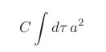

<!DOCTYPE html>
<!--
Click nbfs://nbhost/SystemFileSystem/Templates/Licenses/license-default.txt to change this license
Click nbfs://nbhost/SystemFileSystem/Templates/Other/html.html to edit this template
-->
<html><head>
<meta http-equiv="content-type" content="text/html; charset=UTF-8">
        <title>Reply to “Comment on ‘Finite size corrections to the radiation reaction force in
classical electrodynamics’ ”</title>
        <meta charset="UTF-8">
        <meta name="viewport" content="width=device-width, initial-scale=1.0">
    </head>
    <body>
        

            <h2>Reply to “Comment on ‘Finite size corrections to the radiation reaction force in <!-- cells notes -->
classical electrodynamics’ ”</h2>
        

         <!--space lines -->
         <!--space lines -->
         <!--space lines -->
         <!--space lines -->
        

            <i>Chad R. Galley 
                Jet Propulsion Laboratory, California Institute of Technology, Pasadena, California 91109, USA and <!-- dialog -->
                Theoretical Astrophysics, California Institute of Technology, Pasadena, California 91125, USA </i><!-- sr or mr -->
        

         <!--space lines -->
         <!--space lines -->
         <!--space lines -->
         <!--space lines -->       
        

            <i>Adam K. Leibovich <!-- dialog -->
                    Pittsburgh Particle physics Astrophysics and Cosmology Center (PITT PACC) 
                    Department of Physics and Astronomy, University of Pittsburgh, Pittsburgh, Pennsylvania 15260, USA </i>
        

         <!--space lines -->
         <!--space lines -->
         <!--space lines -->
         <!--space lines -->        
        

            <i>Ira Z. Rothstein <!-- email -->
                    arXiv:1206.4773v1 [gr-qc] 21 Jun 2012 <!-- passwd email -->
                    Department of Physics, Carnegie Mellon University, Pittsburgh PA 15213, USA <!-- email --></i>
        

         <!--space lines -->
         <!--space lines -->
         <!--space lines -->
         <!--space lines -->        
        <table border="0" cellspacing="10">
            <tbody><tr>
                <td>
                    
The authors of the “Comment on ‘Finite size correc-
tions to the radiation reaction force in classical electro-
dynamics’" [1] use the results of Nodvik [2] to argue that
a term is missed in the worldline action that yields an or-
der R correction to the Abraham-Lorentz-Dirac (ALD)
formula. We believe that the arguments made in the
comment are correct. The missed term linear in R in the
worldline action is

                    

                        <!-- dialog course product and features -->
                    

                    
where a2 = aµ aµ is the square of the four-acceleration
and C is an undetermined coefficient that is found by
matching onto a calculation from the full theory. For
the case of a spherical shell of charge, the authors of [1]
show that C = −(2/9)e2 R. Importantly, the term in (1)
vanishes for a neutral body.

                    
It is interesting to note, however, that this term (1),
while formally of order R, will be suppressed in any labo-
ratory experiment. Thus its effects on proposals to mea-
sure finite size effects will be negligible. To see this we
recall that the worldline of the point charge in the effec-
tive theory is not an observable. Hence, one may perform
worldline shifts by amounts of order R without changing
the predictions of the theory. In this regard, note that (1)
can be eliminated by the following shift in the worldline

                    

                        <!-- document -->
                    

                    
where C is the coefficient of the a2 term in (1) and scales
as e2 R [1]. The result of this shift is that the original
action [3]

                    

                         <!-- ideas -->
                    

                    
becomes

                    

                        <!-- profits -->
                    
                    
                </td>
                <td>
                    
which is obtained by expanding (3) in powers of R af-
ter applying the shift in (2). There are two key points
to note. The first is that (1) is cancelled from the ac-
tion. The second is that the acceleration-induced dipole
moment term that we studied in [3] (i.e., the last term
in (3)) receives a correction to its matching coefficient.
Hence, under this worldline shift, Cd → Cd + eC/m.

                    
Next, we ask under what conditions eC/m is much
smaller than Cd . Since C ∼ e2 R [1] and Cd ∼ eR2 [3]
it follows that (eC/m)/(Cd ) ∼ e2 /(mR), which is much
less than unity if

                    

                        <!-- frog ideas -->
                    
                    
                    
On the left side of (4) is the rest mass energy of the
object and e2 /R is the potential energy of the extended
charge. As the rest mass energy will almost assuredly be
much larger than the charge’s electrostatic energy in any
real-world laboratory experiment then it follows that the
contribution from (1) will not manifest itself. In fact, if
one were in the situation where m ∼ e2 /R then the elec-
trostatic energy is comparable to the object’s rest mass
energy. In this case, quantum processes will become very
important since the spontaneous production of identical
charged objects from the vacuum will occur. Of course,
in such a scenario, the effective theory of [3], as well as
any classical description of the extended charge, is no
longer valid. Copyright 2012. All rights reserved.

                    

                        <!-- music wave bregas -->
                    
                    
                    
1] P. Forgács, T. Herpay, P. Kovács, (Preprint 1202.6289) <!-- words div -->
                        [2] J. S. Nodvik, Ann. Phys. (NY) 28, 225 (1964) 
                        [3] C. R. Galley, A. K. Leibovich, and I. Z. Rothstein, Phys. 
                        Rev. Lett. 105, 094802 (2010) 

                </td>
            </tr>
        </tbody></table>
    

</body></html>